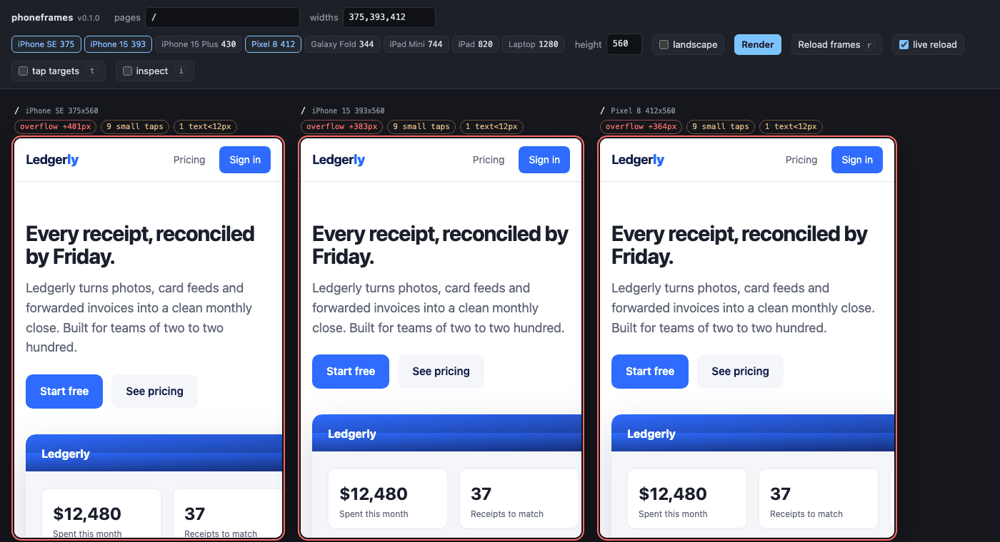
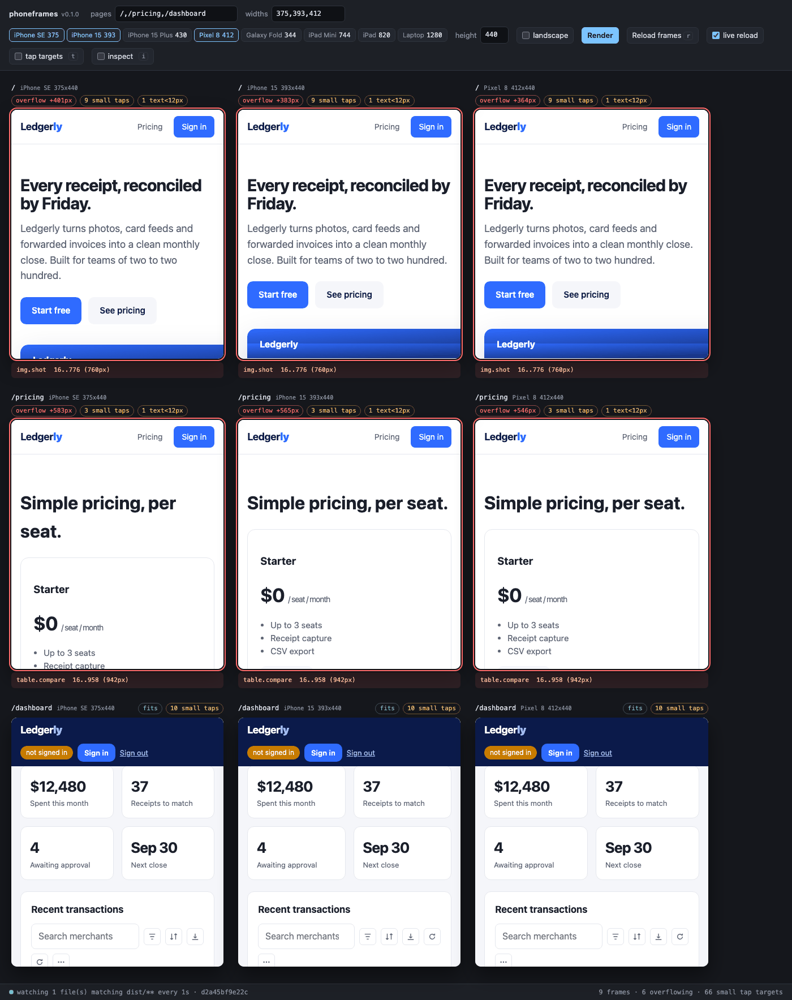
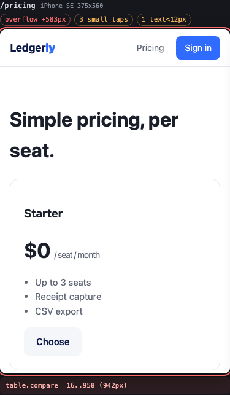
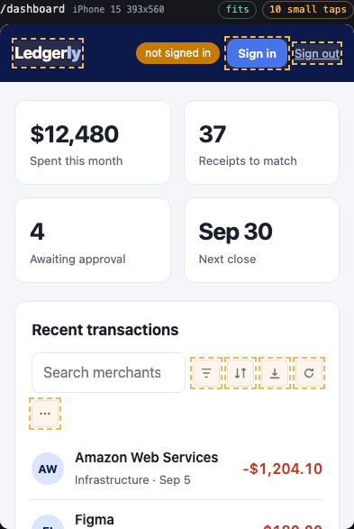
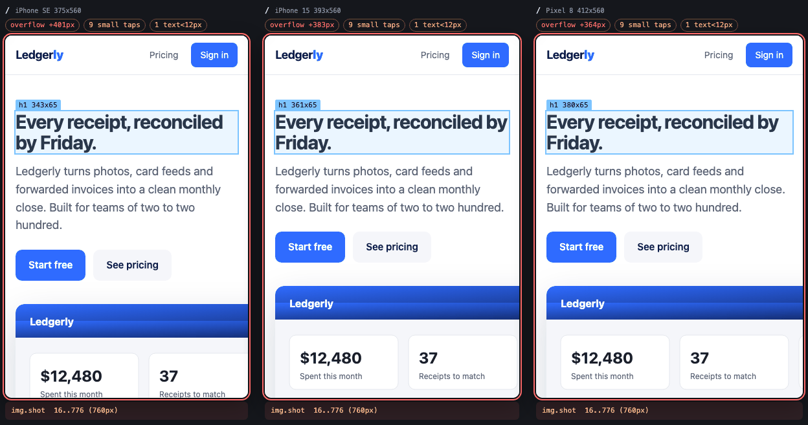
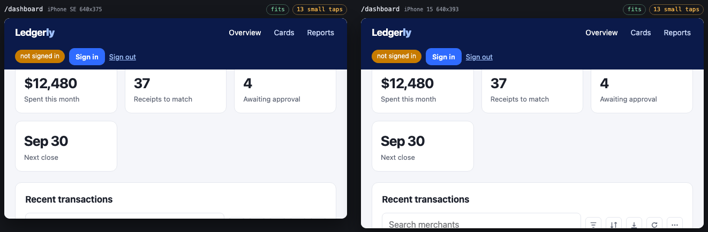
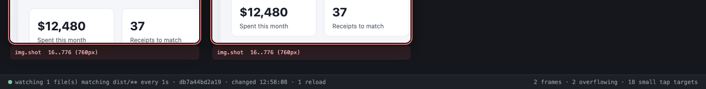
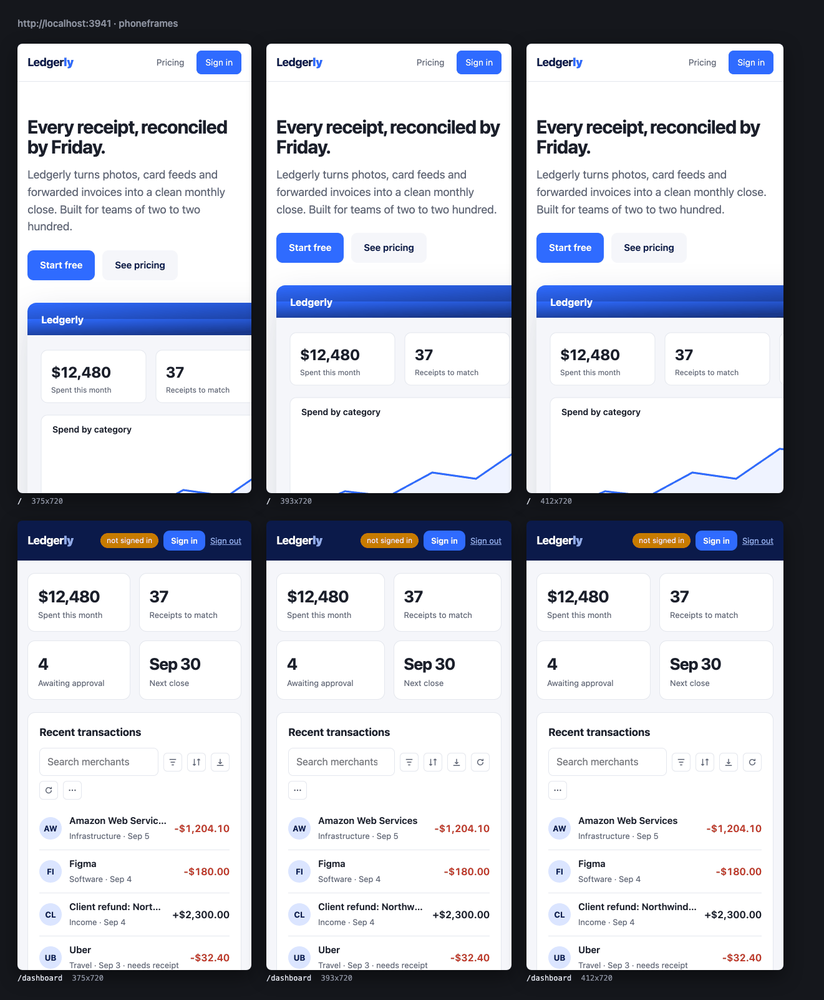

# phoneframes

Preview any locally running web app at phone and tablet sizes, side by side,
in your normal desktop browser. Even when the app sends `X-Frame-Options` or a
CSP `frame-ancestors` directive. Even when your browser window is fullscreen.



- **Zero dependencies.** Python 3.9+ standard library only. Binds to loopback.
- **Diagnostics, not just frames.** Overflow with the culprit element, tap targets
  under 44px, text under 12px, cross-frame inspect, live reload.
- **Runs in CI.** `phoneframes check` fails the build on overflow; `phoneframes shoot`
  writes PNGs and a contact sheet.

## Install

Not on PyPI yet. Until it is, install from git or a checkout:

```sh
pipx install git+https://github.com/infodive/phoneframes      # or: uvx --from git+https://github.com/infodive/phoneframes phoneframes
pipx install .                                                # from a clone
python3 -m phoneframes                                        # no install at all, from a clone
```

Once published: `pipx install phoneframes` / `uvx phoneframes`.

## Try it in 30 seconds

No app of your own running? The repo ships a fake product site that refuses
to be framed and has six planted mobile bugs:

```sh
git clone https://github.com/infodive/phoneframes && cd phoneframes
make showcase        # starts examples/showcase on :3939 and opens the harness
```

With your own app:

```sh
phoneframes --upstream http://localhost:3000 --pages /,/pricing --open
```

## See it

| | |
|---|---|
|  | **The harness.** One column per page x width; each frame carries its own verdict. Layout state lives in the URL, so this is a shareable link. |
|  | **Overflow, named.** The pricing table is 583px too wide; the culprit list says `table.compare` and its bounds. |
|  | **Tap targets.** Press `t` to outline every interactive element under 44x44 CSS px inside the frame. |
|  | **Inspect across frames.** Press `i`, hover an element in one frame, and it is highlighted with its size in every frame; the footer shows the selector. |
|  | **Landscape.** Swaps width and height. Here the app's fixed header grows to two rows and covers the KPI cards. |
|  | **Live reload.** Hash a URL or watch files; the footer shows what is watched, the fingerprint and the last change. |
|  | **`phoneframes shoot`.** A PNG per page x width plus this contact sheet, ready for a pull request. |

## Why not DevTools device mode, Responsively or Polypane?

**DevTools device mode** shows one page at one size in the tab you are in. It
is fine for a quick look and poor at the loop you are actually in while fixing
a responsive layout: three pages at three widths, after every save, without
picking a device from a dropdown per tab. It also cannot tell you *which*
element is 40px too wide.

**Responsively** and **Polypane** are dedicated browsers that solve the
side-by-side problem well, with synced scrolling, device frames and much more.
They are also 200-500 MB Electron apps (Polypane is paid), you use them instead
of your usual browser and extensions, and they do not run in CI. phoneframes
is a 2,000-line Python package with no dependencies that puts the frames in
the browser you already have open, adds the four diagnostics a mobile layout
review actually needs, and ships a `check` command so the same diagnostics
gate a pull request. If you want synced scrolling, device bezels, or emulated
touch, use one of those tools; if you want something you can `pipx install`
and forget, this is it.

## Features

| | |
|---|---|
| **Proxy** | Forwards every method and body, streams responses, strips `X-Frame-Options` and only the `frame-ancestors` part of the CSP, rewrites absolute `Location` headers back to the proxy, forwards cookies both ways, passes gzip/br through untouched, HTTPS upstreams with `--insecure`, `--rewrite-host` for apps that check `Host`. |
| **Harness** | Pages, typed widths or presets (iPhone SE 375, iPhone 15 393, iPhone 15 Plus 430, Pixel 8 412, Galaxy Fold 344, iPad Mini 744, iPad 820, laptop 1280), height, landscape, URL state, Reload frames (`r`). |
| **Diagnostics** | Per frame, same-origin, best-effort: horizontal overflow with outermost culprits by tag/class and bounds; interactive elements under 44x44 CSS px with an overlay (`t`); text under 12px; inspect (`i`). Frames that navigate cross-origin are marked and skipped, never broken. |
| **Live reload** | Pluggable detectors: URL body hash (`--watch-url`, default the first page, every `--watch-interval` seconds) and/or local file mtimes (`--watch-file GLOB`). |
| **`check`** | Headless diagnostics via Playwright (optional): table, JSON report, exit 1 on `--fail-on overflow,taps,text`. |
| **`shoot`** | PNG per page x width plus `contact-sheet.png`, via Playwright (optional). |
| **Config** | `phoneframes.toml` or `[tool.phoneframes]` in `pyproject.toml`, found from the current directory upward. Flags override. `phoneframes init` writes a starter. |

## Configuration

```sh
phoneframes init        # writes a commented phoneframes.toml; commit it
phoneframes             # contributors need nothing else
```

```toml
# phoneframes.toml
upstream = "http://localhost:5173"
pages = ["/", "/pricing", "/dashboard"]
widths = ["se", "iphone15", "pixel8"]
watch_files = ["src/**/*.css"]
fail_on = ["overflow"]

[cookies]
session = "dev-session"
```

Keys: `upstream`, `port`, `pages`, `widths`, `height`, `cookies`, `headers`,
`watch_url`, `watch_files`, `watch_interval`, `rewrite_host`, `insecure`,
`out`, `fail_on`. The same table works under `[tool.phoneframes]` in
`pyproject.toml`. `--no-config` ignores any file. On Python 3.9 and 3.10 a
small built-in TOML parser reads the file (strings, numbers, booleans,
arrays, tables); 3.11+ uses `tomllib`.

## In CI

```sh
pip install 'phoneframes[shoot]' && playwright install --with-deps chromium
phoneframes check --pages /,/pricing --widths se,iphone15,pixel8 --fail-on overflow --json report.json
phoneframes shoot --pages /,/pricing --widths se,iphone15,pixel8 --out shots
```

```
page      size     overflow                small taps  text<12px
--------  -------  ----------------------  ----------  ---------
/         375x800  +401px (img.shot)       9           1
/pricing  375x800  +583px (table.compare)  3           1
/terms    375x800  fits                    3           10

FAIL (overflow):
  / @ 375: overflow +401px (img.shot)
  /pricing @ 375: overflow +583px (table.compare)
```

A complete GitHub Actions job that starts your app, runs `check`, and uploads
the report and screenshots as artifacts is in
[docs/ci-example.yml](docs/ci-example.yml); a pre-push hook is in
[docs/pre-commit-example.yaml](docs/pre-commit-example.yaml).

## Your stack

[docs/recipes.md](docs/recipes.md) has copy-paste commands and the one gotcha
per framework for Vite/React, Next.js, Nuxt, SvelteKit, Django, Flask/FastAPI,
Rails, Go, Laravel, static sites, Storybook and Docker Compose, including how
to keep HMR working (its WebSocket does not go through the proxy).

## Flags

`phoneframes [options]` starts the proxy and harness.

| Flag | Default | What it does |
|---|---|---|
| `--upstream URL` | `http://localhost:3000` | The app to preview. Scheme optional. |
| `--port N` | `8081` | Port to listen on (always `127.0.0.1`). |
| `--open` | off | Open the harness in your default browser. |
| `--pages /a,/b` | `/` | Pages to show, comma-separated. |
| `--widths 375,se,ipad` | `375,393,430` | CSS widths, numbers or preset keys: `se iphone15 iphone15plus pixel8 fold ipadmini ipad laptop`. |
| `--height N` | `800` | Frame height in CSS px. |
| `--cookie name=value` | | Sent with every upstream request. Repeatable. |
| `--header 'Name: value'` | | Sent with every upstream request. Repeatable. |
| `--insecure` | off | Accept self-signed certificates on an HTTPS upstream. |
| `--rewrite-host HOST` | upstream's host | `Host` sent upstream. `preserve` forwards the browser's; any other value is sent literally. |
| `--watch-url URL` | first page | Poll this URL and reload frames when its body changes. |
| `--watch-file GLOB` | | Watch local files by mtime and size. Repeatable, `**` allowed. |
| `--watch-interval S` | `2` | Seconds between checks. |
| `--no-watch` | off | Disable live reload. |
| `--no-config` | off | Ignore `phoneframes.toml` / `pyproject.toml`. |
| `-v`, `--verbose` | off | Log each proxied request. |

`phoneframes check` and `phoneframes shoot` take `--upstream --pages --widths
--height --cookie --header --insecure --no-config --landscape --timeout
--settle`, plus:

| Command | Flag | Default | What it does |
|---|---|---|---|
| check | `--fail-on overflow,taps,text` | `overflow` | Which findings exit 1. `none` only reports. |
| check | `--json PATH` | | Write the JSON report. |
| shoot | `--out DIR` | `shots` | Where PNGs go. |
| shoot | `--full-page` | off | Whole scrollable page, not just the viewport. |
| shoot | `--no-sheet` | off | Skip `contact-sheet.png`. |

`phoneframes init [--upstream URL] [--path FILE] [--force]` writes the starter config.

Harness shortcuts (when the harness itself has focus): `r` reload, `t` tap
overlay, `i` inspect, `Esc` leave a field. URL keys: `p` pages, `w` widths,
`h` height, `o=l` landscape, `live=0`.

## FAQ

**The app sets a CSP. Does phoneframes weaken it?**
Only `frame-ancestors` is removed. `script-src`, `connect-src`, nonces and the
rest are forwarded as sent, for `Content-Security-Policy-Report-Only` too.
`X-Frame-Options` is dropped because it has no other purpose.

**Do cookies and logins work?**
Yes. Browser cookies for `127.0.0.1:8081` are forwarded upstream; upstream
`Set-Cookie` comes back with `Domain` and `Secure` removed so it sticks on the
proxy's loopback origin (`SameSite=None` becomes `Lax`). Log in inside a
frame, or pass `--cookie session=...` / `--header 'Authorization: Bearer ...'`.

**HTTPS upstream?**
`--upstream https://localhost:5173`, and `--insecure` for self-signed
certificates. The proxy itself speaks plain HTTP on loopback, which browsers
treat as a secure context.

**The app redirects to `http://localhost:3000/...` and leaves the proxy.**
Absolute `Location` headers to the upstream origin are rewritten. Client-side
redirects built from a hard-coded host cannot be; use `--rewrite-host preserve`
so the app builds URLs from the proxy's `Host`.

**Django `ALLOWED_HOSTS` / Rails `hosts` / Vite `allowedHosts` reject it.**
They should not: the proxy sends the upstream's own host, and rewrites
`Origin`/`Referer` to match so CSRF checks pass too.

**A frame says "cross-origin".**
The page inside navigated to another origin (an OAuth provider, say). It still
displays; diagnostics need same-origin access and pause for that frame.

**Live reload does not fire.**
The default detector hashes your first page's HTML; a CSS-only change that
leaves it byte-identical will not trigger. Use `--watch-file 'src/**'`.

**Why is a plain text link counted as a small tap target?**
Anything interactive under 44x44 CSS px counts (WCAG 2.5.5, Apple HIG).
Inline links usually trip it, which is why it is a count, not a red flag, and
not in the default `--fail-on`.

## What it deliberately does not do

- **WebSockets.** `Upgrade: websocket` gets a 501. See the recipes for keeping
  your framework's HMR client pointed at the dev server.
- **HTTP/2, server push, trailers, connection pooling.** HTTP/1.1, one fresh
  upstream connection per request.
- **Rewriting bodies.** HTML, JS and JSON pass through byte-for-byte.
- **Binding to anything but `127.0.0.1`.**

## Security note

phoneframes strips framing protection from whatever you point it at and has
no authentication, so it binds to `127.0.0.1` only. Never expose the port on a
network interface, through a tunnel, or via a container port mapping. To
preview on a real device, use your app's own dev server on the LAN.

## Development

```sh
python3 -m unittest                 # tests, stdlib only
make lint                           # ruff, if installed
make showcase                       # the Ledgerly demo site + harness
PY=.venv-shots/bin/python make screenshots   # regenerate docs/images (needs playwright, pillow)
```

See [CONTRIBUTING.md](CONTRIBUTING.md) and [CHANGELOG.md](CHANGELOG.md). MIT.
